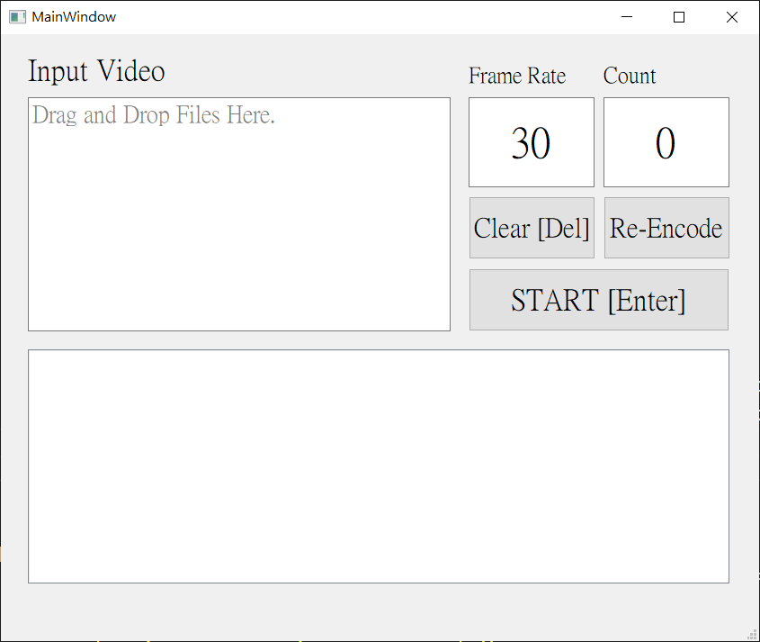

# Movie Splitter GUI
Split movie to pictures.



# Requirement
```
PyQt5
opencv-python
ffmpeg-python
```

# Installation
Make sure `FFmpeg` and `python packages` are installed.

## Installing FFmpeg
Download and install executable file that corresponding to your operating system at [FFmpeg official](https://ffmpeg.org/download.html).

## Installing packages
```bash
git clone git@github.com:JzzzHung/movie-splitter-gui.git
conda create --name movie-splitter-gui python=3.7
conda activate movie-splitter-gui
cd movie-splitter-gui/
pip install -r requirements.txt
```

# Usage
```bash
cd movie-splitter-gui/
python main.py
```

1. Drag and drop one or more movie to upper left zone.
   * User can clear input files in upper left zone by click `Clear` button.
2. Set `Frame Rate` and `Count`
   * `Frame Rate`
     * Can be positive integer or -1.
     * If set to 30, then capture picture every 30 seconds.
     * If set to 0.5, then capture picture every 0.5 seconds.
     * If set to -1, then save all frame of the movie.
   * `Count`
     * Can be integer.
     * If set to 0, the stored pictures will be named starting from 0.
3. Click `START` or `Re-Encode` button.
   * Split movie to pictures by `START` button.
   * If the movie can't be splited, use `Re-Encode` button, which can re-encode and then split the movie.
   * The captured pictures will be stored in a new directory named after its movie at the same directory.
4. The processing log will show in lower zone.